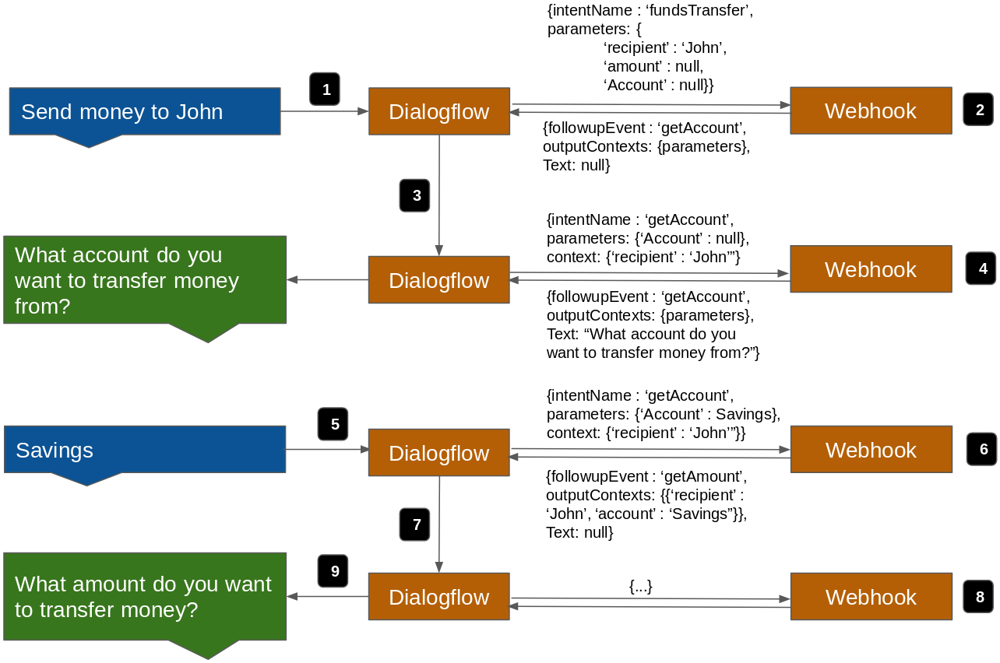

# dialogFlowBankBot
Webhook for a dialogflow banking bot. Demonstrates the use of chaining and output contexts to enable validation and reprompting of parameters before an intent is fulfilled.

##Overview
In other conversational platforms (such as Amazon Lex), each business service (Accounts Summary, Funds Transfer, etc.) can have its own single separate intent. This is not possible in dialogflow because the slot-filling webhook call does not allow us to overwrite any invalid slot nor decide which slot to elicit next. To overcome this, each business service is split into multiple intents, with one intent for each slot. For example, in the case of Funds Transfer, there is 1 initial intent to collect all slots supplied by the user, a \‘getRecipient\_fundsTransfer\’ intent to elicit for recipient’s name if it is missing or invalid, and similiar \‘getAccount\_fundsTransfer\’, \‘getAmount\_fundsTransfer\’ and \‘confirm_fundsTransfer\’ intents.

A sample conversation flow is show in the diagram below. The user first enters the main ‘fundsTransfer’ intent. The webhook checks which slots are empty, and sets the appropriate ‘getAccount\_fundsTransfer’ followup event. The followup event is then called, and the respective intent handler in the webhook realizes that its slot is empty, and sends a message back to the user prompting for the slot. Once the user supplies the ‘account’ slot value, the intent handler sends a followup event for the next ‘getAmount\_fundsTransfer’ intent, and so on.



##Instructions
1. Create a new dialogflow agent. Select the Settings icon (gear symbol) followed by the 'Export and Import' tab.
2. Select 'IMPORT FROM ZIP'.
3. Upload the zip folder entitled 'bankingBotSchematic.zip' found in the repository.
4. Build the bot.
5. If you have not already done so, create a Google Cloud Platform project (or use an existing one) and create a new app engine application in it. Download the Google Cloud SDK and configure the gcloud tool to point to your project. See https://cloud.google.com/appengine/docs/standard/python/quickstart for more details. Enter gcloud init in the terminal to configure the SDK.
6. Deploy the repository to the app engine using the following command:
```
gcloud app deploy

```
7. Build the bot if necessary and test by typing "Funds transfer to John" in the test console.


